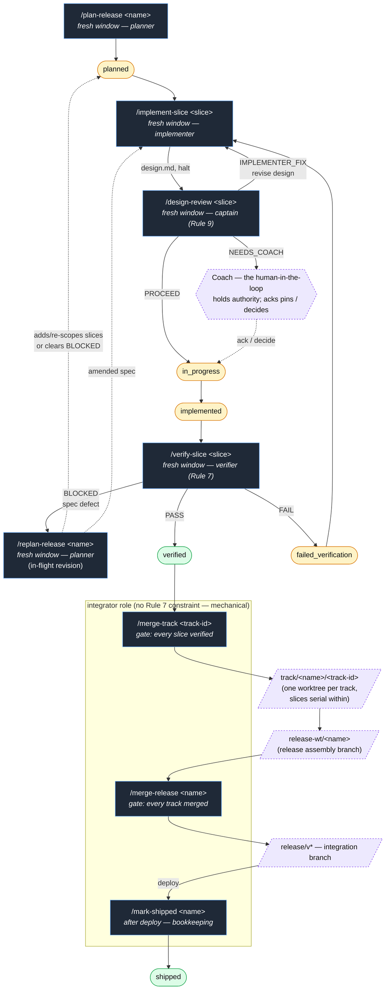

# baton

> A protocol for agent work that survives session boundaries — plan, implement, and verify in sealed contexts, with proof bundles as the only currency between them.

**The baton is the proof bundle.** Four agent roles — planner, implementer, verifier, and the captain who runs design-review (Rule 9) — with one file on disk that crosses between them. An integrator hat lands the verified work, and the **Coach** — the human-in-the-loop who owns the team — holds authority over strategy and product/architecture: the agent roles surface decisions to the Coach but never self-authorise them.

```
                                    fresh-context boundary
                                          (Rule 7)
                               ┌────────────┐  ║
                               │  captain   │  ║   design-review (Rule 9): at the
                               │ /design-   │  ║   top of /implement-slice the
                               │  review    │  ║   implementer drafts design.md and
                               └────────────┘  ║   halts; the captain pins it, the
                         design.md ▲ ▼ PROCEED ║   Coach acks, then code proceeds
    ┌──────────┐    spec.md    ┌────────────┐  ║   proof.md   ┌──────────┐
    │ planner  │ ─────────────►│ implementer│ ─╫─────────────►│ verifier │
    │ /plan-   │               │ /implement-│  ║              │ /verify- │
    │  release │               │   slice    │  ║              │   slice  │
    └──────────┘               └────────────┘  ║              └──────────┘
       ▲   ▲                          ▲        ║                  │
       │   │                     FAIL │        ║                  │
       │   │     <numbered violations>│◄───────╫──────────────────┤
       │   │                                   ║                  │
       │   │   BLOCKED <spec defect>           ║                  │
       │   └────  /replan-release  ◄───────────╫──────────────────┤
       │                                       ║                  │
       │   status.json — state machine                       PASS │
       └─────────────────────  (every role writes,                │
                                planner is the reader)            │
                                                                  ▼
                                                          verified slice
                                                                  │
                                                                  │  gate: every slice
                                                                  │  in the track verified
                                                                  ▼
                              ━━━━━━━━━━━━━━━━━━━━━━━ integrator role ━━━━━━━━━━━━━━━━━━━━━
                              ┌──────────────┐      ┌───────────────┐      ┌───────────────┐
                              │ /merge-track │─────►│/merge-release │─────►│ /mark-shipped │
                              └──────────────┘gate: └───────────────┘after └───────────────┘
                              track/*  →      every release-wt → deploy    verified
                              release-wt      track release/v*             → shipped
                                              merged
```

The double bar between implementer and verifier is the load-bearing piece: when the verifier session starts, it is a **brand-new context window** with no inherited transcript, framing, or reasoning from the implementer. It reads only `spec.md`, `proof.md`, and `status.json` from disk, then returns `PASS` / `FAIL` / `BLOCKED`. Without that separation, baton's Rule 7 collapses into "the same LLM marking its own homework" — which is precisely the failure mode it exists to prevent.

The arrows other than the double bar are read/write traffic through artefacts on disk (`spec.md`, `proof.md`, `status.json`). The `status.json` loop back to the planner is the state machine that tracks each slice's lifecycle (`planned` → `in_progress` → `implemented` → `verified` → `shipped`); `/replan-release` is the planner re-entry point that handles `BLOCKED` verdicts and any in-flight revision.

The **integrator** role below the slice loop runs the merge pipeline on gates, not on time: `/merge-track` requires every slice in the track to be `verified`; `/merge-release` requires every track to be merged into `release-wt/<name>`; `/mark-shipped` is the after-deploy bookkeeping step that flips every `verified` slice to the terminal `shipped` state with the deployed commit as evidence. The integrator is the only role that doesn't need a fresh context — the work is mechanical (`git merge --no-ff` with the gate checks built into each command), the planner/implementer/verifier have already produced everything that matters, and the integrator's job is just to land it without breaking the gates. Same agent session can run several integrator commands in a row; one merge per shared integration branch at a time, but otherwise no Rule 7 constraint.

**License:** [MIT](LICENSE) — permissive, attribution-only. Use it in any project, commercial or otherwise.

---

## Why baton

If you've shipped non-trivial work with an LLM coding agent, you may have hit one or more of these:

- **Overclaiming.** Session ends with "implementation complete" and a 90% confidence score. Next session opens the repo and finds half the work missing, the other half wired up wrong, with tests that pass because they only exercise leaf components.
- **Dark code.** A primitive is built, tested with TDD, and never wired into a user-reachable surface. Component renders zero times in production. Discovered weeks later during an audit.
- **Silent deferrals.** Inline `// TODO`, `// deferred`, `// later` markers in committed code — referencing decisions that were never tracked, never acknowledged, and now have no owner.
- **Context loss.** Substantial analysis lives only in chat transcript. `/clear` happens. The reasoning is gone. The next session starts from scratch.
- **Plan / proof drift.** Planning docs say one thing, implementation does another, the divergence is never surfaced.

baton is the minimum-viable protocol that addresses these *specifically* — not a complete engineering methodology. Eleven rules, four roles, seven slash commands. The rules are derived from a real release audit where each of the above failure modes was observed and traced to a specific structural gap.

## The eleven rules

Each rule has a one-line summary here and a full doc explaining the failure mode, the rule, and why looser variants don't work.

| # | Rule | One-liner | Doc |
|---|------|-----------|-----|
| 1 | Reachability gate | Every UI feature's first failing test renders through the user-path integration point, not the leaf component in isolation. | [reachability-gate.md](claude/baton/reachability-gate.md) |
| 2 | No silent deferrals | Inline "deferred" / "TODO" / "later" requires *why* + *tracking* + *acknowledgement* — all three, surfaced before the comment lands. | [no-silent-deferrals.md](claude/baton/no-silent-deferrals.md) |
| 3 | Capture discipline | Conversation context is the most ephemeral persistence layer; subagent findings and decisions land in durable storage before session ends. | [capture-discipline.md](claude/baton/capture-discipline.md) |
| 4 | Commit messages as capture | Decisions are restated in the commit message body, not "see plan X" — git log becomes the immutable record. | [commit-messages-as-capture.md](claude/baton/commit-messages-as-capture.md) |
| 5 | Session discipline | Sessions anchored to durable trackers (issues, plans); captures at every session boundary, not only at the end. | [session-discipline.md](claude/baton/session-discipline.md) |
| 6 | Proof bundle | Completion claims require a structured proof file written from live repo state, not paraphrased from memory. | [proof-bundle.md](claude/baton/proof-bundle.md) |
| 7 | Adversarial verification | Verification runs in a fresh-context session loaded only with the proof artefacts — never in the implementer's window. | [adversarial-verification.md](claude/baton/adversarial-verification.md) |
| 8 | Requirements fidelity | The spec is not an axiom: needs are verified (29148 quality), validated (human sense-check), and traced (need → AC → test) so a need can't drop silently between intake and spec. | [requirements-fidelity.md](claude/baton/requirements-fidelity.md) |
| 9 | Design fidelity | Design stays human-owned, with judgement calibrated to each choice's stakes (reversibility × blast-radius); Type-1 choices need a recorded human decision the model can't self-authorise. | [design-fidelity.md](claude/baton/design-fidelity.md) |
| 10 | Customer journey validation | Critical end-to-end journeys are a ratified, version-controlled artefact, re-walked against real boundaries — a journey walked over a mocked boundary proves nothing. | [customer-journey-validation.md](claude/baton/customer-journey-validation.md) |
| 11 | Process-global mutation guard | Any change mutating process-global state (working directory, environment, or which worktree/branch a tool acts on) must guarantee restore, assert the target before git ops, and prove the guard with a reachability artefact. | [process-global-mutation.md](claude/baton/process-global-mutation.md) |

Rules 1–5 are advisory text — splice them into your project's `AGENTS.md` / `CLAUDE.md` and they shape every session. Rules 6 through 11 require the Release Mode harness (the slash commands and templates this repo installs) to be enforceable.

## Example artefacts

The protocol's whole pitch is "files between sessions." Here's what those files actually look like.

A `status.json` (the state machine for a single slice):

```json
{
  "slice_id": "S03-account-settings-page",
  "state": "implemented",
  "planned_files": ["src/components/AccountProfileSection.tsx", "e2e/account-settings.spec.ts"],
  "actual_files": ["src/components/AccountProfileSection.tsx", "src/components/useAccountStore.ts", "e2e/account-settings.spec.ts"],
  "test_commands": ["pnpm playwright test e2e/account-settings.spec.ts"],
  "reachability_artifacts": ["e2e/account-settings.spec.ts:24 — user gesture + assertion"],
  "verification": { "result": null, "verifier_was_fresh_context": null, "violations": [] }
}
```

A trimmed `proof.md`:

```markdown
# proof — S03-account-settings-page

## Scope
User can update their profile via the account settings page and see the changes reflected.

## Files changed
3 files; e2e/account-settings.spec.ts is new and exercises the integration point.

## Test results
Playwright suite — 8 tests, all green. Captured output: ...

## Reachability artefact
e2e/account-settings.spec.ts:24 simulates the full user gesture
(click → form fill → submit) and asserts the updated profile renders.

## Delivered
- Form submit updates profile in store
- Dashboard re-renders within 200ms

## Not delivered
- Multi-currency support (deferred to S05; tracked in journal.md, acknowledged 2026-05-12)
```

A `journal.md` accumulates state transitions and verifier verdicts over the slice's lifetime. The full templates live in [`claude/baton/release-mode-template/`](claude/baton/release-mode-template/).

## Install

Baton is an agent protocol — the easiest way to install it is to let your coding agent do it. Open Claude Code, Codex, Gemini CLI, OpenCode, Hermes Agent, or any agent in a terminal and paste:

> Clone https://github.com/sawy3r/baton, read its `claude/baton/INSTALL.md`, install Baton for the tool I'm using, and wire the Baton rules fragment into my agent instructions. Show me the plan first.

The agent clones the repo, places the rule docs, role prompts, and templates where your tool reads them, and — the step a shell script can't do for you — wires the `AGENTS-fragment.md` rules into your `AGENTS.md` / `CLAUDE.md` / `GEMINI.md`. [`INSTALL.md`](claude/baton/INSTALL.md) lists the per-tool targets the agent follows; "Per-project setup" below covers what every repo needs regardless.

### Prefer a script? (Claude Code / Codex)

```bash
git clone https://github.com/sawy3r/baton.git ~/projects/baton
cd ~/projects/baton
./install.sh           # Claude Code  — installs ~/.claude/commands/, ~/.claude/baton/, ~/.claude/bin/
./install-codex.sh     # OpenAI Codex — installs ~/.agents/skills/baton-*/, ~/.codex/baton/, ~/.codex/bin/
```

Preview with `./install.sh --dry-run` (or `--help`); set `CLAUDE_HOME` / `CODEX_HOME` / `AGENTS_HOME` to relocate; update later with `git pull && ./install.sh`. Either installer is safe on the same machine — they touch disjoint directories. The scripts install the slash commands **natively for Claude Code and Codex**; on other tools the agent-driven path installs the rules and harness and you drive the command docs / role prompts directly (native command adapters for other tools are on the roadmap). Neither script touches your `CLAUDE.md` — that wiring is exactly what the agent-driven path automates.

## What lands where

| Source in repo                         | Installed to                                  | Purpose                                              |
| -------------------------------------- | --------------------------------------------- | ---------------------------------------------------- |
| `claude/commands/*.md`                 | `~/.claude/commands/`                         | User-level slash commands, available in every repo  |
| `claude/baton/`                        | `~/.claude/baton/`                            | Rule docs, role prompts, release-mode templates     |
| `bin/release-verify.sh`                | `~/.claude/bin/release-verify.sh`             | Deterministic first-pass verifier, invoked by abs path |
| `bin/release-board-status.sh`          | `~/.claude/bin/release-board-status.sh`       | Release board — terminal go/no-go verdict (exit 0/1)   |
| `bin/release-board-ui.mjs`             | `~/.claude/bin/release-board-ui.mjs`          | Release board — auto-refreshing HTML dashboard         |
| `bin/lib/release-board.mjs`            | `~/.claude/bin/lib/release-board.mjs`         | Shared branch-aware board reader (used by both above)  |

Nothing under `~/.claude/CLAUDE.md` is touched. Wiring the AGENTS-fragment rules into your global instructions is a deliberate manual step — see the post-install message printed by `install.sh`.

## Per-project setup

Each repo that wants to use Release Mode needs:

1. A `docs/release/` directory at the repo root (the commands create sub-folders here per release). If your docs site renders content from a different location, symlink it to `docs`.
2. The Rule 1–5 fragment from `~/.claude/baton/AGENTS-fragment.md` appended to the project's **in-repo** `AGENTS.md` (and, ideally, the full rules vendored into `docs/baton/`).

> Appending the fragment to `~/.claude/CLAUDE.md` instead is **not** equivalent for
> any repo with collaborators, contributors, or CI — that file lives on your machine
> and no one else's agent reads it. The global copy makes Baton feel adopted in your
> own sessions, which is the trap: the per-project `AGENTS.md` gets skipped and a
> shared/public repo ships with no rules for anyone but you. Wire `AGENTS.md`
> in-repo for any repo others touch; treat the global file as a personal fallback
> only. (SwornAgent's `sworn init` does this in-repo wiring for you.)

That's it. `/plan-release <YYYY-MM-DD-theme>` from a fresh session bootstraps the release folder from the templates.

## The session loop



For each release:

1. **Planner session** — fresh window. Human pastes `/plan-release <name>`. Conversational discovery; planner writes `intake.md`, decomposes into slices, groups the slices into touchpoint-disjoint **tracks**, writes `spec.md` per slice. No code written here.
2. **Implementer session, per slice** — fresh window. Human runs `/implement-slice <slice-id>`. Implementer reads `spec.md`, makes changes, writes `proof.md` from live repo state, runs `release-verify.sh`, stops at state `implemented`. **Never marks `verified`.**
3. **Verifier session, per slice** — *another* fresh window with no inherited context. Human runs `/verify-slice <slice-id>`. Verifier reads only `spec.md`, `proof.md`, `status.json`, and live repo state. Returns `PASS` / `FAIL: <numbered violations>` / `BLOCKED: <reason>`.
   - **PASS** → slice transitions to `verified`, available for `/merge-track`.
   - **FAIL** → slice goes to `failed_verification`; back to the implementer with the verifier's numbered violations.
   - **BLOCKED** → spec defect or external gap the implementer can't resolve. Handoff routes *forward* (never back to the implementer) to `/replan-release <name>` — the only command authorised to amend a spec or re-group tracks on an in-flight release. Once the planner ratifies the resolution, the slice re-enters at `/implement-slice`.
4. **Replan in flight, when needed** — `/replan-release <name>` is the planner re-entry point for any in-flight revision: adding unplanned scope, dropping a not-started slice, re-grouping tracks, or clearing a BLOCKED verdict. It reconciles board state from `release-wt/<name>` and every `track/<name>/*` branch (not the stale `index.md` on the integration branch) before proposing changes, and propagates the revised plan back out to in-flight track branches so the verifier doesn't loop on a stale spec.
The next three steps are the **integrator** role — the only role that doesn't need a fresh context. The work is mechanical (`git merge --no-ff` with the gate checks built into each command), the planner/implementer/verifier have already produced everything that matters, and the integrator's job is to land it without breaking the gates. Same agent session can run several integrator commands in a row; one merge per shared integration branch at a time, but otherwise no Rule 7 constraint.

5. **Merge a track** (integrator) — when every slice in a track is `verified`, `/merge-track <track-id>` merges the track branch into the release assembly branch `release-wt/<name>` with `--no-ff`. Gate: every slice in the track verified; a planner-domain conflict (cross-track touchpoint collision) BLOCKs and routes to `/replan-release`.
6. **Merge the release** (integrator) — when every track is merged into `release-wt/<name>`, `/merge-release <name>` merges the assembly branch into the version integration branch (e.g. `release/v0.5.0`) with `--no-ff`. Gate: every track merged (which implies every slice verified).
7. **Mark it shipped** (integrator) — once the integration branch has actually deployed to production, `/mark-shipped <name>` flips every `verified` slice to the terminal `shipped` state, recording the deployed commit as evidence. Bookkeeping only — it does not deploy.

Tracks run in parallel — one implement/verify session line per track, each in its own worktree. The model is in [`claude/baton/track-mode.md`](claude/baton/track-mode.md). The cost of three sessions per slice is one extra session window. On a flat-rate plan that's effectively free. On metered usage it's still cheaper than the rework cost of an overclaimed slice discovered three sessions later.

> GitHub renders the diagram above as a flowchart natively. If you read this README in a tool without Mermaid support, the prose 1-7 below it is the source of truth.

## Tracking the board

Two read-only tools report release progress straight from git — no database, no state file. Both resolve every slice's authoritative `status.json` from the `track/*` and `release-wt/*` branches, so the terminal verdict and the dashboard agree by construction:

- `release-board-status.sh [--verbose]` — terminal go/no-go verdict. Exits `0` when every slice is in a terminal state (`verified` / `shipped` / `deferred`), `1` otherwise — scriptable as a ship gate.
- `release-board-ui.mjs [--port N]` — a local auto-refreshing HTML dashboard at `http://localhost:3333`, incomplete releases sorted to the top.

Run either from inside the repo. The release-docs root defaults to `docs/release/`; set `BATON_RELEASE_DIR` to override for custom layouts.

## Path tokens

The slash commands use two runtime tokens the agent resolves on first Bash call:

- **`<REPO_ROOT>`** — output of `git rev-parse --show-toplevel` from the project's primary checkout.
- **`<REPO_BASENAME>`** — `basename "<REPO_ROOT>"`, used to namespace the release worktrees folder (`$HOME/projects/<REPO_BASENAME>-worktrees/`) so multiple projects on the same machine don't collide.

## Caveats

- **Claude Code and OpenAI Codex today.** The slash commands target Claude Code's `~/.claude/commands/` (via `install.sh`) and Codex's `~/.agents/skills/` (via `install-codex.sh`, covering Codex CLI and the Codex Mac App, which share `~/.codex/` config). Gemini CLI and OpenCode adapters are on the [roadmap](ROADMAP.md).
- **Codex skills are mechanically derived** from the Claude Code command bodies at install time, with paths rewritten to `~/.codex/` and a header explaining Codex's free-form argument resolution prepended. Behaviour is preserved; a few presentation differences remain (e.g. `AskUserQuestion` reads fine as "prompt the human" but doesn't render as a Codex-native picker).
- **Per-project memory is optional.** If your tool maintains per-project persistent memory (Claude Code stores it under `~/.claude/projects/<encoded-cwd>/memory/MEMORY.md`), the planner reads it at session start. On a clean install it doesn't exist; the step skips silently.
- **`release-verify.sh` is opinionated.** It checks for required artefact files, valid JSON in `status.json`, non-empty diff vs the base branch, dark-code markers in changed files, and required `proof.md` sections. It does *not* make subjective calls about whether the diff actually implements the spec — that's the LLM verifier's job.

## Roadmap

baton today ships slash commands for Claude Code only. Cross-tool adapters for OpenAI Codex CLI, Gemini CLI, and OpenCode are next; a Claude Code plugin manifest comes after. See [ROADMAP.md](ROADMAP.md) for the full phased design.

## Contributing

The eleven rules are deliberately minimal and deliberately fixed — they're the smallest intervention that addresses the specific failure modes catalogued in the rule docs' `## Provenance` sections. If you want a different rule-set, fork and amend.

For everything else — bugs in the harness, slash-command improvements, adapter contributions for other tools, doc clarifications — issues and PRs are welcome.

## Releases

Versions and release notes live on the [Releases page](https://github.com/sawy3r/baton/releases). Tag the version you want, clone or download, run `./install.sh`.
